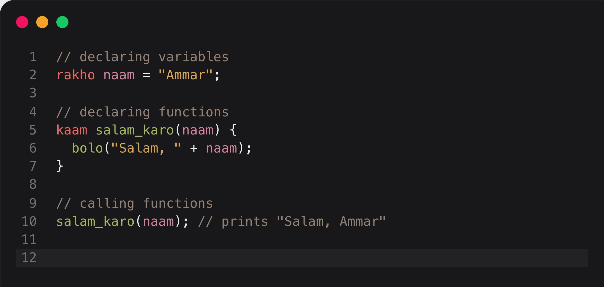
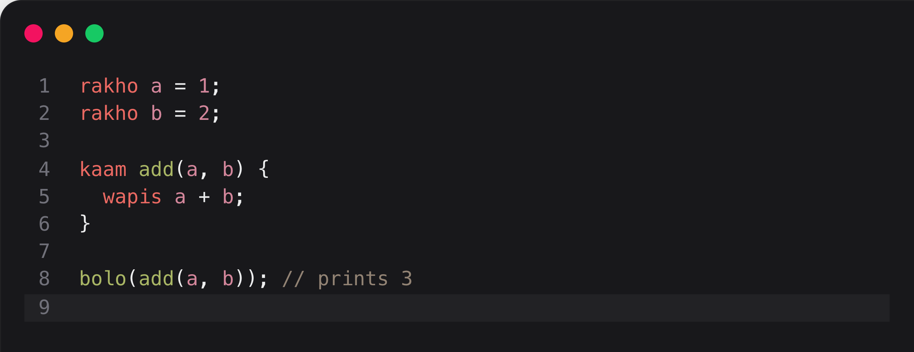

<div align="center">

<h1>qalam</h1>
<p><a href="https://en.wikipedia.org/wiki/Roman_Urdu">Roman urdu</a> inspired, interpreted programming language written in Rust.</p>
<p></p>
<div>
  <a href="https://crates.io/crates/qalam"></a>
  <a href="https://crates.io/crates/qalam"></a>
</div>
</div>

<div align="center">
    
</div>

## Table of Contents
- [Introduction](#introduction)
- [Using `qalam`](#using-qalam)
- [Syntax](#syntax)
  * [Keywords](#keywords)
  * [Conditionals](#conditionals)
  * [Loops](#loops)
  * [Objects (Classes)](#objects--classes-)
- [Types](#types)
- [Native Functions](#native-functions)
- [Complete Example](#complete-example)
- [Speed](#speed)

## Introduction
As a learning exercise, to really hone my skills, I wanted to write a programming language myself. In order to accomplish this, I'm following the amazing tutorial called [Crafting Interpreters by Robert Nystrom](https://craftinginterpreters.com/).

While Robert goes through the entire process, step-by-step, to create a programming language he calls Lox, I didn't want to simply follow a tutorial and copy-paste code. I have found that real learning occurs when you change up tutorials a little so that you can have a deeper understanding.

In order to do this, I decided to create my own syntax for the language with the same general features as Lox. I also decided to use Rust to make the language instead of Java so that I cannot possibly copy-paste code.

> [!NOTE]
> Some of you who have been here before remember that Qalam was very different before. It was "Islamic/Arabic terminology inspired". 
> I decided to change the syntax because this project is more of learning exercise/joke than a real-world or useful product. For this
> reason, I thought that it's not very appropriate to use Islamically inspired syntax for something that is a joke.
> 
> All of this worked out because Qalam actually means the same thing in both Urdu and Arabic, pen. 

## Using `qalam`
1. Install the `qalam` interpreter
```bash
cargo install qalam
```

2. Create a `.qlm` file with your source code
```bash
echo "bolo \"sab ko salam!\"" > main.qlm
```

3. Run the `qalam` code
```bash
qalam main.qlm
>> hello world!
```

## Syntax
### Keywords
| Syntax | Meaning/Inspiration | Usage |
| :----: | :------------------ | :---- |
| `rakho` | To put/place. Values are *placed* into the variable. | Variable declarations |
| `kaam` | Work/Job/Action. Functions do things (actions/jobs) | Function declarations |
| `wapis` | To return | Return statement |
| `bolo` | To say | Print statement |
| `khali` | Empty. Signifies a value is not present | Null value |


<details>
<summary>Code</summary>

```text
rakho a = 1;
rakho b = 2;

kaam add(a, b) {
  wapis a + b;
}

bolo(add(a, b));
// prints 3
```
</details>

### Conditionals
| Syntax | Meaning/Inspiration | Usage |
| :----: | :------------------ | :---- |
| `agar` | If. Self-explanatory | If statement |
| `warna` | Else. Self-explanatory | Else statement |
| `sach` | Truth. A boolean `true` indicates truth. | Boolean `true` value |
| `jhoot` | Lie. A boolean `false` indicates falsehood, lies, etc. | Boolean `false` value |
| `aur` | And. Self-explanatory. | And operator. Can also use `&&` |
| `ya` | Or. Self-explanatory. | Or operator. Can also use `\|\|` |
| `nahi` | Not. Self-explanatory. | Not operator. Can also use `!` |

<image src="./images/qalam-conditionals.png" width="1000" />
<details>
<summary>Code</summary>

```text
rakho a = sach;
rakho b = jhoot;

agar(a aur b) {
  // do something
} warna {
  // do something
}
```
</details>

### Loops
| Syntax | Meaning/Inspiration | Usage |
| :----: | :------------------ | :---- |
| `har` | Every. Does something for every value that passes the condition. | For loop |
| `jabtak` | While/As long as. Self-explanatory | While loop |
<!-- These are currently not even implemented so leave them out. -->
<!-- | `iftar` | Breaking fast. The time when Muslims break fast is called `iftar`. | Break statement | -->
<!-- | `safar` | Journey or travel. Signifies the loop is going to continue on it's journey. | Continue statement | -->

<image src="./images/qalam-loops.png" width="1000" />
<details>
<summary>Code</summary>

```text
har(rakho i = 0; i < 10; i++) {
    bolo(i); // prints numbers 0 - 9
}

rakho i = 0;
jabtak(i < 0) {
    bolo(i); // prints numbers 0 - 9
}
```
</details>

### Objects (Classes)
| Syntax | Meaning/Inspiration | Usage |
| :----: | :------------------ | :---- |
| `jamat` | Group/Class. Self-explanatory. | Class definition |
| `banao` | To make/build. The constructor makes the class object. | Class constructor function |
| `yeh` | This. Self-explanatory | Instance accessor (`this` in JavaScript, `self` in Python/Rust) | 
| `asli` | Original. The superclass is the original (parent) of the class. | Superclass accessor (`super` in JavaScript) |
| `shamil` | Include. The base class *includes* the functionality of the superclass. | Class inheritance operator |  

<image src="./images/qalam-classes.png" width="1000" />
<details>
<summary>Code</summary>

```text
jamat Shaks { // Person
    banao(naam) {
        yeh.naam = naam;
    }

    taruf() { // introduce
        // my name is + this.name
        bolo("Mere naam " + yeh.naam + " hai!"); 
    }
}

jamat Student shamil Shaks {
    banao(naam, subject) {
        asli.banao(naam);
        yeh.subject = subject;
    }

    taruf() {
        asli.taruf()
        // I am studying + this.subject
        bolo("Mai " yeh.subject + " par ta hoon.");
    }
}

rakho admi = Shaks("Ammar");
rakho engineer = Student("Amir", "Engineering");

admi.taruf();
// prints Mere naam Ammar hai!

engineer.taruf(); 
// prints 
// Mere naam Amir hai!
// Mai Engineering par ta hoon.

```
</details>

## Types
Below are the built-in types supported by `qalam`:
| Type     | Description                                                                                                                      | Initialization Example          |
| -------- | -------------------------------------------------------------------------------------------------------------------------------- | ------------------------------- |
| `number` | Numerical value. All numbers are stored as floating point values. Numbers without a fractional part are considered as integers.  | `niyya num = 1.0;`              |
| `string` | Collection of characters. Characters can be indexed with integers. Initialize with double quotes.                                | `niyya name = "Ammar";`         |
| `bool`   | Boolean true or false. `haqq` = true, `batil` = false.                                                                           | `niyya is_foo = haqq;`          |
| `array`  | Collection of any values. Values can be indexed and set with integers. Initialize with square braces.                            | `niyya arr = [1, "one", haqq];` |

## Native Functions
I've implemented a few native functions to the program:
| Function Name | Parameters                                                                 | Return Type | Description                                                                                  | 
| ------------- | -------------------------------------------------------------------------- | ----------- | -------------------------------------------------------------------------------------------- |
| `clock`       |                                                                            | `number`    | Returns the time elapsed since the epoch in seconds                                          |
| `typeof`      | `arg: any`                                                                 | `string`    | Returns type of argument as a string                                                         |
| `str`         | `arg: any`                                                                 | `string`    | Converts the argument to a string                                                            |
| `str2num`     | `arg: string`                                                              | `number`    | Converts the argument to a number. Throws error if not possible.                             |
| `substr`      | `arg: string, start: number (positive int), length: number (positive int)` | `string`    | Returns a substring of the argument starting at `start` with length of `length`              |
| `index_of`    | `arg: string, substring: string`                                           | `number`    | Returns the index of the start of a substring in the argument. Returns -1 if not found.      |
| `replace`     | `arg: string, old_substr: string, new_substr: string`                      | `string`    | Replaces all occurrences of `old_substr` in the argument with `new_substr`.                  |
| `len`         | `arg: string \| array`                                                     | `number`    | Returns the length of a string or array.                                                     |
| `max`         | `a: number, b: number`                                                     | `number`    | Returns the maximum of the inputs                                                            |
| `min`         | `a: number, b: number`                                                     | `number`    | Returns the minimum of the inputs                                                            |
| `pow`         | `base: number, exp: number`                                                | `number`    | Raises the base to the power of the exponent                                                 |
| `random`      | `min: number, max: number`                                                 | `number`    | Returns a random number in the range of `min` to `max`                                       |
| `random_int`  | `min: number (int), max: number (int)`                                     | `number`    | Returns a random integer in the range of `min` to `max`                                      |
| `push`        | `arr: array, val: any`                                                     | `ghaib`     | Pushes a value to the end of an array                                                        |
| `pop`         | `arr: array`                                                               | `any`       | Pops a value from the end of the array and returns it. If it does not exist, returns `ghaib` |
| `Array`       | `size: number (positive int), value: any`                                  | `array`     | Creates an array of `size` values all initialized to `value`.                                |
| `code`        | `char: string`                                                             | `number`    | Returns the character code for a single character string.                                    |
| `floor`       | `num: number`                                                              | `number`    | Returns the closest integer less than or equal to `num`                                      |
| `ceil`        | `num: number`                                                              | `number`    | Returns the closest integer greater than or equal to `num`                                   |
| `round`       | `num: number`                                                              | `number`    | Returns the closest to `num`. If `num` is halfway between 2 integers, returns away from 0.   |

## Complete Example
To showcase the functionalty of `qalam`, I've provided an example below of reversing a linked list:

```
jamat ListNode {
  banao(value, next) {
    yeh.value = value;
    yeh.next = next;
  }
}

kaam list_to_string(head) {
  rakho string = "";
  rakho curr = head;
  jabtak(curr != ghaib) {
    string += str(curr.value);
    agar(curr.next) {
      string += " -> ";
    }
    curr = curr.next; 
  }

  wapis string;
}

rakho list = ListNode(1, ListNode(2, ListNode(3, ListNode(4, ListNode(5, ghaib)))));

kaam reverse_list(head) {
  rakho prev = ghaib;
  rakho curr = head;
  rakho next = ghaib;
  jabtak(curr != ghaib) {
    next = curr.next;
    curr.next = prev;
    prev = curr;
    curr = next;
  }

  wapis prev;
}

bolo("Original list:"));
bolo((list_to_string(list));
bolo("Reversed list:");
bolo(list_to_string(reverse_list(list)));
```

### Output
```
Original list:
1 -> 2 -> 3 -> 4 -> 5
Reversed list:
5 -> 4 -> 3 -> 2 -> 1
```

### More Examples
I've provided many more examples, in the [examples directory](./examples). You can run them with `cargo run --example <name>` or by running the `main.qlm` file inside the examples subdirectory with `qalam <file_path>`. 

## Speed
`qalam` is an interpreted language with dynamic types. However, since there are essentially zero optimizations done, it is extremely slow. I am also an extreme amateur when it comes to Rust programming, therefore, it is probably even slower than Robert's implementation in Java as I definitely did a million things wrong when using Rust. 

In order to showcase how slow it actually is, I'll compare it's speed to JavaScript and Python (interpreted, dynamically typed languages). For the comparison, I'll use the calculation of the 30th fibonacci number using a recursive algorithm. 

Below are the scripts for each language
### Python
```python
import time

def fib(n):
  if n <= 1:
    return n
  else:
    return fib(n - 1) + fib(n - 2)

start = time.time()
result = fib(30)
end = time.time()
print(f"{end - start}")
```

### JavaScript
```javascript
function fib(n) {
  if (n <= 1) {
    return n;
  } else {
    return fib(n - 1) + fib(n - 2);
  }
}

let start = Date.now() / 1000;
let result = fib(30);
let end = Date.now() / 1000;
console.log(`${end - start}`);
```

### Qalam
```
kaam fib(n) {
  agra(n <= 1) {
    wapis n;
  } magar {
    wapis fib(n - 1) + fib(n - 2);
  }
}

rakho start = clock();
rakho result = fib(30);
rakho end = clock();
bolo(str(end - start));
```

Each test was run 10 times and the average runtime is tabulated below:
| Language | Average Runtime (s) | 
| -------- | --------------- | 
| JavaScript | 0.0185 |
| Python | 0.2238 |
| Qalam | 36.2470 |

JavaScript and Python take less than second each. Qalam takes half a minute. It is extremely slow, however, I am still proud that it works lol.
